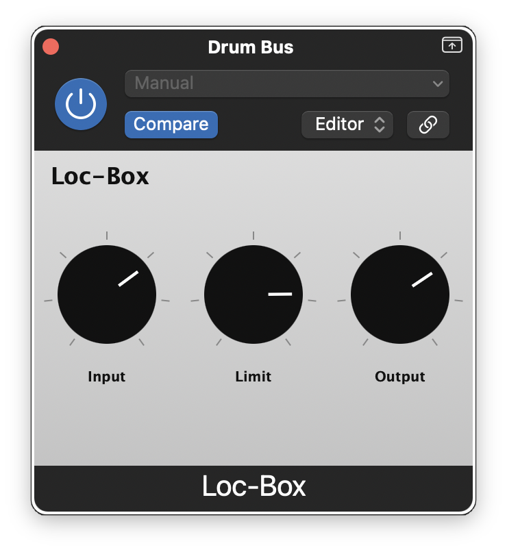

# Loc-Box



A digital emulation of the **Shure Level Loc (M62/M62V)** brickwall limiter, built as an AU/VST3 audio plugin with [JUCE](https://juce.com/).

The Level Loc is a discrete transistor limiter from the late 1960s, originally designed for PA and podium microphone use. It became a cult favorite in music production for its aggressive, pumping compression character.

## Controls

| Knob | Range | Description |
|------|-------|-------------|
| **INPUT** | 0 -- 100% | Signal level into the limiter. Audio taper, up to +24 dB. |
| **LIMIT** | 0 -- 100% | Compression amount. At 0% the threshold sits at 0 dBFS (no limiting); at 100% it drops to -24 dBFS (heavy brickwall compression). |
| **OUTPUT** | 0 -- 100% | Makeup gain. Audio taper, up to +24 dB. |

## What it models

- **JFET gain element (2N5458)** -- voltage-controlled variable resistor with level-dependent even-harmonic distortion that increases with gain reduction.
- **Peak envelope detector** -- full-wave rectifier into an RC network with 500 us attack and 700 ms release, matching the original's 39 ohm / 1M ohm / 2 uF timing components.
- **Brickwall compression** -- approximately 7:1 ratio (40 dB input change produces ~6 dB output change), per the Shure spec sheet.
- **Transistor soft saturation** -- models the 2N5088 amplifier stages clipping at high levels (3% THD spec).

## Building

Requires CMake 3.22+, Ninja, and JUCE (expected at `/Users/chris/src/github/JUCE`).

```bash
# Configure
cmake -B build -G Ninja \
    -DCMAKE_OSX_ARCHITECTURES="arm64;x86_64" \
    -DCMAKE_OSX_DEPLOYMENT_TARGET=11.0 \
    -DCMAKE_BUILD_TYPE=Release \
    -DCMAKE_C_COMPILER=$(xcrun -f clang) \
    -DCMAKE_CXX_COMPILER=$(xcrun -f clang++)

# Build
cmake --build build --config Release
```

Artifacts land in `build/LocBox_artefacts/Release/`:
- `AU/LocBox.component`
- `VST3/LocBox.vst3`
- `Standalone/LocBox.app`

## Install

```bash
# AU
cp -R build/LocBox_artefacts/Release/AU/LocBox.component \
      ~/Library/Audio/Plug-Ins/Components/
codesign --force --sign "-" ~/Library/Audio/Plug-Ins/Components/LocBox.component

# VST3
cp -R build/LocBox_artefacts/Release/VST3/LocBox.vst3 \
      ~/Library/Audio/Plug-Ins/VST3/
codesign --force --sign "-" ~/Library/Audio/Plug-Ins/VST3/LocBox.vst3
```

Validate the AU with:

```bash
auval -v aufx LBOX CVDA
```

## License

GPL-3.0 -- see [LICENSE](LICENSE).
